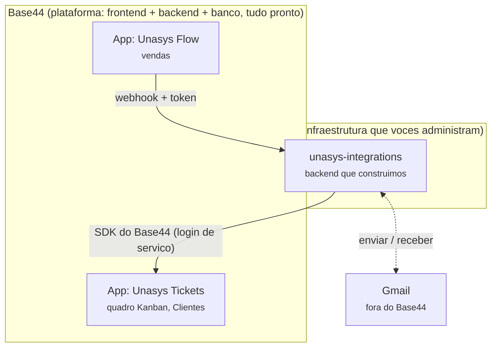

# Guia técnico para quem não é dev

> Este documento existe pra uma razão específica: você vai conversar com um desenvolvedor sênior
> sobre um sistema que você mandou construir, mas não escreveu. A ideia aqui não é decorar termos
> — é entender o suficiente pra fazer boas perguntas, notar quando algo não faz sentido, e explicar
> o "porquê" das decisões, não só o "o quê". Todo exemplo usado abaixo é do seu sistema de verdade,
> não é genérico.

## 1. Frontend e backend — os dois conceitos que tudo depende

Todo sistema com tela (site, aplicativo) geralmente tem duas metades:

- **Frontend** — o que a pessoa vê e clica. Botões, formulários, cores, o quadro Kanban do Unasys
  Tickets. Roda no navegador de quem está usando.
- **Backend** — o que fica escondido, rodando num servidor em algum lugar. Guarda os dados (banco
  de dados), decide quem pode ver o quê (autenticação/permissões), e faz a lógica de negócio ("se
  a venda X chegou, cria um Ticket assim").

Pensa numa loja: o frontend é o balcão e a vitrine — o que o cliente vê. O backend é o estoque, o
caixa registrando a venda, o sistema que calcula o troco — invisível pra quem está na loja, mas é
o que faz tudo funcionar de verdade.

**Detalhe importante pro seu caso:** nem sempre frontend e backend são dois projetos separados.
Às vezes vêm junto, prontos, numa plataforma só — que é exatamente o caso do Base44.

## 2. O panorama: quais sistemas existem hoje

Você tem, hoje, dois tipos de sistema bem diferentes rodando:

### 2.1 — Apps dentro do Base44

O **Base44** é uma plataforma que já entrega frontend + backend + banco de dados + login de
usuários prontos, tudo junto — você (ou quem configurou) desenha as telas e os dados pelo editor
do Base44, sem escrever código de servidor do zero. Dentro dela, sua empresa tem vários **apps**
independentes, cada um com sua própria tela e seus próprios dados:

- **Unasys Tickets** — o sistema de chamados/implantação (o quadro Kanban que os analistas usam).
- **Unasys Flow** — o sistema comercial, de onde as vendas saem.
- Outros: Unasys Administrativo, Unasys Melhorias, Indicadores Unasys.

Cada um desses é um produto completo por conta própria, hospedado e mantido pelo Base44 — vocês
não pagam servidor, não fazem deploy, não cuidam de banco de dados pra esses.

### 2.2 — O `unasys-integrations`, que construímos do zero

Esse é diferente: é um **backend puro**, sem tela de produto (tem só um painel de administração
interno, que é outra coisa — ver seção 7). Ele não guarda dado nenhum por conta própria; a função
dele é ser a **ponte** entre sistemas que não conseguem conversar diretamente:

- O Unasys Flow (dentro do Base44) não consegue avisar o Gmail "manda um email".
- O Gmail não consegue avisar o Unasys Tickets (dentro do Base44) "chegou uma resposta do cliente".
- Esse servidor resolve isso: fica no meio, ouvindo os dois lados, traduzindo cada evento numa
  ação no Base44 (criar/atualizar um Ticket, por exemplo).

Ele roda numa **VPS** (um servidor alugado, na Hostinger) que vocês pagam e administram — bem
diferente do Base44, que "só funciona" sem vocês cuidarem da infraestrutura.

## 3. Vocabulário essencial

Termos que vão aparecer numa conversa técnica sobre esse sistema — cada um com o que significa
**no seu caso especificamente**, não a definição de dicionário.

| Termo | O que é | No seu sistema |
|---|---|---|
| **API** | Um "cardápio" de operações que um sistema oferece pra outro sistema chamar (não é pra humano, é sistema conversando com sistema). | O `unasys-integrations` expõe uma API: um conjunto de endereços que o Unasys Flow e o Gmail chamam. |
| **Endpoint** | Um endereço específico dentro de uma API, que faz uma coisa. | `/webhooks/sales-data/receive` é o endpoint que recebe uma venda nova. |
| **Webhook** | Um tipo de endpoint feito pra receber um "aviso" de outro sistema quando algo acontece lá (em vez de ficar perguntando "aconteceu? aconteceu?" toda hora). | O Unasys Flow "avisa" nosso servidor via webhook quando fecha uma venda. |
| **Token** | Uma senha longa e aleatória que prova "sou eu mesmo" entre sistemas (não é a senha de uma pessoa). | Cada integração (vendas, Gmail) tem o próprio token — sem ele, a chamada é recusada. |
| **SDK** | Uma caixa de ferramentas pronta que um fornecedor (aqui, o Base44) disponibiliza pra você programar contra o sistema dele sem reinventar a roda. | Usamos o SDK oficial do Base44 pra criar/atualizar Tickets, em vez de mexer direto no banco de dados dele. |
| **Entity** | O nome que o Base44 dá pra "tabela" — um tipo de dado com campos definidos (Ticket, Client, TicketEmail...). | `Ticket`, `Client` e `TicketEmail` são as entities que o `unasys-integrations` lê/escreve. |
| **Deploy** | O ato de colocar uma versão nova do código pra rodar de verdade, no lugar de produção. | Toda vez que mudamos algo no código do servidor, tem que "fazer o deploy" pra VPS — não acontece sozinho. |
| **Servidor / VPS** | Um computador (geralmente remoto, alugado) que fica ligado 24/7 rodando um programa. VPS = uma "fatia" de servidor só sua. | A VPS da Hostinger onde o `unasys-integrations` roda sem parar. |
| **Variável de ambiente** | Um jeito de guardar configuração e segredos (senhas, chaves) *fora* do código-fonte, pra não vazar sem querer. | Ficam no arquivo `.env` do servidor — nunca aparecem no código nem no Git. |
| **Processo / PM2** | O programa rodando de fato na memória do servidor. PM2 é uma ferramenta que mantém esse processo vivo, reiniciando sozinho se cair. | O processo se chama `unasys-api`; se o servidor reiniciar ou o programa travar, o PM2 sobe ele de novo sozinho. |
| **HTTPS / SSL** | A camada de criptografia que protege o que trafega entre navegador/sistema e servidor (o cadeado no navegador). | O domínio `integracoes.unasyshub.com.br` tem certificado válido, renovado automaticamente. |
| **DNS / domínio** | O "catálogo de endereços" da internet, que traduz um nome (`integracoes.unasyshub.com.br`) pro endereço numérico real do servidor. | Já configurado, apontando pra VPS da Hostinger. |
| **Repositório / Git** | Onde o código-fonte fica guardado com histórico de todas as mudanças (quem mudou o quê, quando). | O código do `unasys-integrations` (ainda sendo preparado pra ir pro GitHub — ver conversa anterior). |
| **RLS (regra de acesso)** | Regras dentro do Base44 que decidem quem pode ver/editar cada registro, dependendo de quem está logado. | Foi a causa de um bug real: um Ticket só aparecia pra quem tinha a "vertical" certa no perfil. |

## 4. Conceitos gerais de programação (o vocabulário que todo dev usa, não só deste projeto)

Essa parte é mais "fundamentos de programação" do que "sobre o seu sistema" — mas é o que mais
aparece numa conversa técnica solta, então vale entender antes de precisar perguntar o que
significa no meio da frase.

### 4.1 — Paradigma de programação (o que é isso)

Um **paradigma** é só um "estilo"/conjunto de regras pra organizar como o código é escrito. Não é
uma linguagem — é uma filosofia. As duas que mais aparecem em conversa:

- **Orientação a Objetos (POO / OOP)** — organiza o código em torno de **objetos**: "pacotes" que
  juntam dado e comportamento. Vem de uma **classe**, que é o molde. Ex: uma classe `Cliente` seria
  o molde; cada cliente de verdade (a Unipaper, a Fiorentina) seria um **objeto** (uma "instância"
  daquela classe).
- **Programação funcional/procedural** — organiza o código em torno de **funções** que recebem
  dado, processam, e devolvem outro dado — sem "empacotar" dado e comportamento juntos como a POO
  faz.

**Os 4 pilares clássicos da POO** (termos que aparecem sempre que alguém fala de POO):

| Pilar | O que significa |
|---|---|
| **Encapsulamento** | Esconder os detalhes internos de um objeto, expondo só o necessário pra fora — como o painel do carro, que esconde o motor. |
| **Herança** | Uma classe "filha" reaproveita o que uma classe "mãe" já define, adicionando ou mudando só o que é diferente. |
| **Polimorfismo** | Chamar a mesma operação em objetos diferentes, e cada um responder do seu próprio jeito. |
| **Abstração** | Modelar só o que importa pro problema, ignorando detalhes irrelevantes. |

**Sobre o seu projeto especificamente:** o `unasys-integrations` **não usa POO** — conferimos e
não existe nenhuma `class` escrita no código. O estilo usado é mais próximo do funcional: funções
soltas (ex: `sendGmailMessage`, `processSalesPayload`) organizadas em arquivos por responsabilidade
(`services/`, `routes/`), e os "moldes" de dado são feitos com **`interface`** do TypeScript (24
delas no projeto) em vez de `class` — uma interface descreve o *formato* de um dado (quais campos
um Ticket tem, por exemplo) sem empacotar comportamento junto.

Isso **não é incompleto nem "errado"** — é uma escolha comum e moderna em backends Node.js
pequenos/médios. Só vale saber, porque se o dev sênior perguntar "cadê as classes?", a resposta é
"não usamos, o projeto é funcional" — uma resposta técnica válida, não uma desculpa.

### 4.2 — Tipagem: TypeScript vs JavaScript

**JavaScript** é a linguagem que roda em qualquer navegador e também em servidores (via Node.js).
Ela é "dinamicamente tipada": uma variável pode virar texto, número, qualquer coisa, sem avisar.

**TypeScript** é JavaScript com uma camada extra: **tipos**. Você declara "isso aqui é sempre um
texto", "isso aqui é sempre um dos 4 valores: baixa/media/alta/critica" — e o programa recusa
compilar se algum código tentar usar errado. É a linguagem usada em 100% do `unasys-integrations`.
Vantagem prática: pega muitos erros *antes* de ir pra produção, não depois.

### 4.3 — Termos estruturais do dia a dia

| Termo | O que é |
|---|---|
| **Função** | Um bloco de código nomeado que recebe entradas (parâmetros), faz algo, e devolve uma saída. A unidade básica de organização no estilo funcional. |
| **Parâmetro / argumento** | O valor que você passa pra dentro de uma função quando chama ela. |
| **Retorno** | O valor que a função devolve no final. |
| **Módulo** | Um arquivo de código que pode ser reaproveitado em outros arquivos (via `import`/`export`). |
| **Biblioteca** | Código pronto, feito por terceiros, que você importa pra não reescrever algo comum (ex: `nodemailer`, pra mandar email). |
| **Framework** | Parecido com biblioteca, mas mais "no comando": ele dita a estrutura geral do seu programa, e seu código se encaixa nele (ex: Express, que organiza como as rotas HTTP funcionam). |
| **Pacote / dependência** | Uma biblioteca instalada no projeto, listada no `package.json`, baixada via `npm install`. |

### 4.4 — Código que espera (assíncrono)

Boa parte do que o `unasys-integrations` faz é **esperar** algo externo responder: o Base44, o
Gmail, a internet em geral. Isso é **assíncrono** — o programa não trava parado esperando; ele
"marca" aquele ponto e segue outras coisas até a resposta chegar.

- **Promise** — uma "promessa" de que um valor vai existir no futuro (quando a resposta chegar).
- **`async` / `await`** — a forma como o código fica *parecendo* que espera na hora certa, sem
  travar o programa inteiro. É o padrão usado em praticamente toda função do projeto.
- **Callback** — um jeito mais antigo de fazer a mesma coisa (uma função que é chamada quando o
  resultado fica pronto). Menos usado hoje, mas ainda aparece em bibliotecas mais antigas.

### 4.5 — Cliente-servidor, HTTP e status codes

Toda comunicação neste sistema segue o modelo **cliente-servidor**: alguém pede (cliente — ex: o
Unasys Flow), alguém responde (servidor — o `unasys-integrations`), usando o protocolo **HTTP**.

- **Método HTTP** — o "verbo" da requisição: `GET` (buscar algo), `POST` (criar/enviar algo),
  `PUT`/`PATCH` (atualizar), `DELETE` (remover). O recebimento de uma venda usa `POST`.
- **JSON** — o formato de texto usado pra trocar dados estruturados (`{"nome": "valor"}`) — é como
  praticamente todo payload deste sistema é formatado.
- **Status code** — um número que a resposta HTTP sempre traz, dizendo o que aconteceu:

| Código | Significa | Exemplo no seu sistema |
|---|---|---|
| `200` | Deu certo (leitura) | `/health` respondendo que está tudo bem |
| `201` | Deu certo (criou algo novo) | Um Ticket novo foi criado |
| `400` | O pedido veio errado/incompleto | Faltou um campo obrigatório no payload |
| `401` | Não autenticado / token errado | Token de webhook inválido ou ausente |
| `404` | Não encontrado | Uma integração cadastrada com nome errado |
| `500` | Erro interno, algo quebrou | Uma falha inesperada ao falar com o Base44 |
| `503` | Serviço indisponível (ainda não configurado) | Gmail chamado antes de configurar a senha de app |

### 4.6 — Middleware

Um **middleware** é uma função que roda **no meio do caminho**, entre a requisição chegar e a
lógica de negócio de fato rodar — geralmente pra checar algo antes de deixar passar. É um conceito
central no Express (o framework usado aqui). No `unasys-integrations`, os exemplos são literais:

- Um middleware confere o **token** antes de qualquer rota de webhook fazer qualquer coisa.
- Outro middleware **registra a requisição** no log de atividade do painel.
- Outro exige a **senha do painel de novo** antes de aceitar uma mudança sensível de configuração.

### 4.7 — Arquitetura: monólito, microsserviço, MVC

- **Monólito** — um sistema único, grande, que faz tudo junto. O Base44 (por trás dos panos) é
  assim, do ponto de vista de vocês: uma coisa só que entrega tela + dados + login.
- **Microsserviço** — um sistema pequeno, com uma responsabilidade específica, que conversa com
  outros por API. O `unasys-integrations` tem esse espírito: só cuida de traduzir integrações
  externas, nada além disso.
- **MVC (Model-View-Controller)** — um padrão clássico de organizar código em 3 partes (dado,
  tela, lógica que liga os dois). O `unasys-integrations` não segue MVC ao pé da letra (não tem
  "View" — não é uma aplicação com tela de produto), mas a pasta `routes/` faz o papel de
  "Controller" (recebe a requisição e decide o que fazer) e `services/` guarda a lógica que mexe
  com dado — uma organização parecida em espírito.

### 4.8 — Controle de versão (Git), além do que já foi dito

- **Commit** — uma "foto" de uma mudança no código, com uma mensagem explicando o que mudou.
- **Branch** — uma linha paralela de desenvolvimento, pra mexer em algo sem afetar o código
  principal até estar pronto.
- **Merge** — juntar uma branch de volta na principal.
- **Pull Request (PR)** — um pedido formal de "revisa e aprova essa mudança antes de juntar" —
  onde outra pessoa (o dev sênior, por exemplo) olha o código antes dele entrar de vez.

## 5. Um exemplo completo, do início ao fim

Pra fixar como as peças conversam, o caminho de uma venda real:

1. Um vendedor fecha uma venda no **Unasys Flow** (tela dentro do Base44).
2. O Unasys Flow dispara um **webhook**: uma chamada HTTP pro `unasys-integrations`, incluindo o
   **token** secreto de vendas no cabeçalho da requisição.
3. O `unasys-integrations` confere o token. Se estiver certo, segue; se não, devolve erro `401`
   sem fazer mais nada (nem toca no Base44).
4. Usando o **SDK** do Base44 (autenticado com uma conta de serviço própria — não a sua conta
   pessoal), o servidor:
   - Procura ou cria o **Cliente** (entity `Client`) daquele CNPJ.
   - Cria (ou atualiza, se já existir) o **Ticket** (entity `Ticket`) vinculado a esse cliente.
5. O analista abre o **Unasys Tickets** (outra tela, dentro do mesmo Base44) e o Ticket já está lá,
   na coluna certa do quadro.

Tudo isso acontece em menos de um segundo, sem ninguém apertar botão nenhum.

## 6. Perguntas que um dev sênior provavelmente vai fazer

Com respostas curtas, pra você já chegar afiado:

**"Qual stack vocês usam?"**
> O `unasys-integrations` é Node.js com TypeScript e Express, rodando numa VPS Hostinger via PM2.
> O restante (Unasys Tickets, Unasys Flow) é Base44 — uma plataforma no-code/low-code que já
> inclui frontend, backend e banco de dados.

**"Onde fica o banco de dados?"**
> Não temos banco de dados próprio nesse servidor — os dados (Tickets, Clientes) ficam no banco do
> Base44. O `unasys-integrations` só lê e escreve nele através do SDK oficial, autenticado.

**"Como funciona o deploy? Tem CI/CD?"**
> Hoje é manual: build local, envio pra VPS via SSH, reinício do processo via PM2. Não tem pipeline
> automático ainda (ex: GitHub Actions) — é um ponto que vale melhorar se o time crescer.

**"Onde ficam os segredos (senhas, tokens)?"**
> Os segredos de inicialização (login do Base44, login do painel) ficam num arquivo `.env` na VPS,
> fora do código e fora do controle de versão. Os tokens de integração e credenciais do Gmail
> ficam num arquivo de configuração separado, editável por um painel administrativo protegido por
> senha — também fora do código.

**"Isso tem testes automatizados?"**
> Não. A validação até agora foi manual (testar cada rota com dado real e conferir no Base44).
> Vale perguntar ao dev sênior se compensa investir nisso, dado o tamanho atual do projeto.

**"Por que vocês não usam a service role do Base44 pra ter acesso total?"**
> Porque o Base44 só libera essa permissão elevada pra código rodando *dentro* da própria
> plataforma dele (funções de backend hospedadas lá). Como nosso servidor roda numa VPS externa,
> ele se autentica como um usuário comum (conta de serviço), com as permissões que esse usuário
> tiver no Base44 — não ignora as regras de acesso.

## 7. Onde cada coisa fica (mapa rápido)

| O quê | Onde fica | Quem edita |
|---|---|---|
| Tela e dados do Unasys Tickets | Base44 | Time, direto no Base44 |
| Tela e dados do Unasys Flow | Base44 | Time, direto no Base44 |
| Código do `unasys-integrations` | Nesta pasta / futuramente GitHub | Desenvolvedor |
| Processo rodando de verdade | VPS Hostinger, via PM2 | Deploy (SSH) |
| Tokens de webhook e credenciais do Gmail | Arquivo de configuração na VPS | Painel (`/dashboard`) |
| Login do servidor no Base44, login do painel | Arquivo `.env` na VPS | Só via SSH, direto no servidor |
| Domínio e certificado HTTPS | CloudPanel na VPS | CloudPanel |

## 8. O que vale perguntar pro dev sênior logo de cara

Não pra testar ele — pra você entender melhor o estado real do projeto:

- "Você bateu o olho no [README.md](README.md) e no [COMO-FUNCIONA.md](COMO-FUNCIONA.md)? Faz
  sentido pra você, ou falta algo?"
- "O que você mudaria primeiro nessa arquitetura, se fosse continuar isso?"
- "Vale a pena colocar teste automatizado / CI-CD nesse ponto do projeto, ou é cedo?"
- "Os dados que a gente está montando manualmente (tipo qual `vertical` cada Ticket usa) fazem
  sentido pra você, ou tem um jeito mais robusto de resolver isso?"
